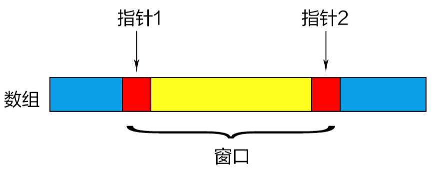

# 滑动窗口

滑动窗口思想常用于处理数组、字符串相关的问题，它使用两个指针，指针间表示为一个窗口，这个窗口不停地滑动，每次都记录窗口的当前状态，再找出符合条件的适合的窗口，以求得解。



## 常见形式
### 类型 1：窗口大小随指针移动而改变（常见）

例题：「LeetCode」 第 209 题：[长度最小的子数组](https://leetcode-cn.com/problems/minimum-size-subarray-sum/)

> 给定一个含有 n 个正整数的数组和一个正整数 s ，找出该数组中满足其和 ≥ s 的长度最小的连续子数组。如果不存在符合条件的连续子数组，返回 0。
>
> 示例: 
>
> 输入: s = 7, nums = [2,3,1,2,4,3]
> 输出: 2
> 解释: 子数组 [4,3] 是该条件下的长度最小的连续子数组。

**面对一个问题，如果我们一时想不到好的解法，可以先从暴力解入手。本题暴力解思路如下**：

* 遍历由索引 i 到索引 j 的所有的连续子数组  `nums[i...j]`

* 计算子数组的和 sum，验证  `sum >= s`

* 对于所有满足条件的解，找出长度最小的解


可以看出，因为子数组的长度可以由 n 到 1，所以本解法的时间复杂度为：O (n^3)

#### 暴力解的问题

我们可以很快发现，如果我们可以知道 `nums[i...j] `的值，那 `nums[i...j-1]` 的值是不是早已被计算过了呢？因此，**暴力解的最大问题，就是存在大量重复的运算**

#### 使用滑动窗口，避免重复运算

为了使每次计算都有意义，我们可以定义一个左指针 `lp` ，一个右指针 `rp`  ，而 `nums[lp...rp]` 就是一个「窗口」。应用窗口的思路如下：

* 若窗口间的元素之和小于 s ，即 `sum(nums[lp...rp]) < s` ，则让右指针滑动一位，即 `rp+1` ，使得窗口间元素之和变大；
* 若窗口间的元素之和大于等于于 s ，即 `sum(nums[lp...rp]) >= s` ，我们记录此时窗口的长度，并让左指针滑动一位，即 `lp+1` ，使得窗口间元素之和变小，若此时的窗口仍满足条件，则再记录窗口的长度，直到窗口不满足条件；
* 返回记录的窗口中，最小的窗口长度

python 代码：

```python
class Solution:
    def minSubArrayLen(self, s: int, nums) -> int:
        lp = 0  # 左指针
        rp = 0  # 右指针
        table = []  # 存放所有满足条件的子数组长度
        total = 0  # 记录满足条件的窗口长度
        nlen = len(nums)
        
        while rp < nlen:
            total += nums[rp]
            while total >= s:  # 当窗口满足条件时，不断移动左指针，直到窗口不满足条件
                table.append(rp - lp + 1)
                total -= nums[lp]
                lp += 1
            rp += 1

        return min(table) if table else 0  # 如果找不到满足条件的窗口，返回0
```

我们可以发现，最后需要返回的其实只有一个值，并不需要记录所有满足条件的窗口长度，因此代码在空间上可以优化，代码如下：

```python
class Solution:
    def minSubArrayLen(self, s: int, nums) -> int:
        nlen = len(nums)
        res = nlen+1  # 将最小长度初始化为一个不可能的值
        lp = 0
        rp = 0
        total = 0  # 记录数组之和
        while rp < nlen:
            total += nums[rp]
            while total >= s:
                res = min(res, rp-lp+1)  # 始终存储最小的长度
                total -= nums[lp]
                lp += 1
            rp += 1

        return res if res < nlen+1 else 0
```

**注意：**

* 对于窗口，我们必须明确左右指针的具体含义，即指针指向的元素属不属于这个窗口。在本题中，我们定义的是 `[lp...rp]` 左闭右闭的窗口，即左指针与右指针指向的元素都属于窗口，各位也可以尝试定义 `[lp...rp)` 或 `(lp...rp]` 的窗口

### 类型 2：窗口大小不随指针移动而改变

例题：「LeetCode」 第 219 题：[存在重复元素 II](https://leetcode-cn.com/problems/contains-duplicate-ii/)

> 给定一个整数数组和一个整数 k，判断数组中是否存在两个不同的索引 i 和 j，使得 nums [i] = nums [j]，并且 i 和 j 的差的 绝对值 至多为 k。
>
> 示例 1:
>
> 输入: nums = [1,2,3,1], k = 3
> 输出: true
>
> 示例 2：
>
> 输入: nums = [1,2,3,1,2,3], k = 2
> 输出: false

#### 思路

这道题乍一看好像和滑动窗口没关系，但我们可以发现这是一个数组问题，需要频繁地使用索引（指针），而且有成立条件。因此我们可以将题目转换一下，变为：

* 给定一个整数数组和大小为 k 的窗口，判断窗口中是否能存在重复元素。

这样一来，本题就变成了一个窗口大小不变的滑动窗口问题，思路也不难想了：

* 定义一个长度最大为 k 的窗口；
* 若某元素不在窗口中，则将此元素加入窗口；若此时窗口超过了最大长度，则将先加进来的元素移出窗口；
* 若某元素已在窗口中，返回 True ；若遍历整个数组后，窗口中仍没有重复元素，返回 False

python 代码：

```python
class Solution:
    def containsNearbyDuplicate(self, nums: List[int], k: int) -> bool:
        window = set()  # 使用一个集合表示窗口

        for i in range(len(nums)):
            if nums[i] in window:
                return True

            window.add(nums[i])

            if len(window) > k:
                window.remove(nums[i-k])  # 移出最先加进来的元素

        return False
```

### 类型3：使用对撞指针的滑动窗口

「对撞指针」是双指针的一种变形，一个指针指向数组头，一个指向数组尾，两指针往相反的方向移动。而指针间可以被认为是一个窗口，这类滑动窗口也常常带有一点贪心算法的思想，例题如下：

「LeetCode」 第 11 题：[盛最多水的容器](https://leetcode-cn.com/problems/container-with-most-water/)

> 给你 n 个非负整数 a1，a2，...，an，每个数代表坐标中的一个点 (i, ai) 。在坐标内画 n 条垂直线，垂直线 i 的两个端点分别为 (i, ai) 和 (i, 0)。找出其中的两条线，使得它们与 x 轴共同构成的容器可以容纳最多的水。
>
> 示例：
>
> 输入：[1,8,6,2,5,4,8,3,7]
> 输出：49

假设给定的数组为 `height` ，则示例中的输出则可解释为 `49 = min(height[1], height[8]) * (8-1)` 

#### 思路

根据「木桶原理」，我们知道决定一个容器能盛多少水的因素有两个，一个是容器本身有多大，二是最短的那块木板有多长。而在这道题，数组中的元素值代表木板长度，两元素间的间距代表容器本身的大小，即窗口的大小。

可以发现，我们虽然不知道木板最长是多少，但窗口可以有多大是知道的——即数组长度 - 1那么大。因此我们不妨在一开始就把窗口设为最大，每次判断当前木板的长度和窗口大小能盛多少水，再逐渐将窗口缩小。至此，代码也就呼之欲出了。

python代码：

```python
class Solution:
    def maxArea(self, height: List[int]) -> int:
        lp = 0  # 左指针，指向左侧的木板
        rp = len(height) - 1  # 右指针，指向右侧的木板
        res = 0  # 能容纳的最大水量
        
        while lp < rp:
            # 每次计算当前窗口和木板长度能容纳的水量，并更新能容纳的最大水量
            temp = min(height[lp], height[rp]) * (rp-lp)  
            res = max(res, temp)
            # 不断更换长度相对短的那个木板
            if height[lp] < height[rp]:
                lp += 1   
            else:
                rp -= 1
        
        return res
```

## 总结

其实滑动窗口问题还是以类型 1 居多，重点在于思考左右指针的具体含义、窗口状态的具体含义，以及窗口要如何变化，变化条件又是什么。明白了这些，也就彻底理解了滑动窗口。

## 精选例题

|                             题目                             |                   提示                   |
| :----------------------------------------------------------: | :--------------------------------------: |
| [3.无重复字符的最长子串](https://leetcode-cn.com/problems/longest-substring-without-repeating-characters/) | 非常经典的一道滑动窗口问题，建议反复理解 |
| [438. 找到字符串中所有字母异位词](https://leetcode-cn.com/problems/find-all-anagrams-in-a-string/) |      「无重复字符的最长子串」的变形      |
| [76. 最小覆盖子串](https://leetcode-cn.com/problems/minimum-window-substring/) | 「无重复字符的最长子串」的进阶，相对较难 |

